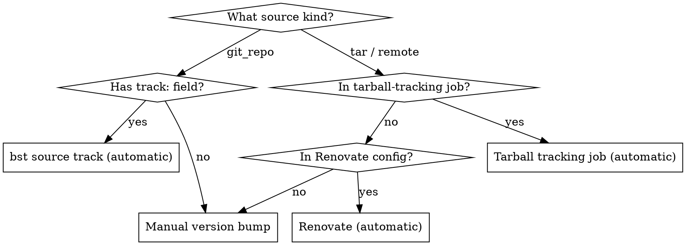

# Updating Upstream Refs (dakota)

## Powerlevel

- **Weapon:** Cryosthesia 77K
- **Aspect:** Unknown
- **Dispatch name:** `Unknown · Cryosthesia 77K`
- **Level:** 1

Load with: `cat ~/src/skills/dakota-update-refs/SKILL.md`

## When to Use

- Updating a package version in dakota (bumping tarball URL and SHA256)
- Understanding which tracking mechanism applies to a given element (`bst source track`, tarball job, or Renovate)
- Adding a new element to the automated tracking workflow
- Debugging why an element shows a stale or outdated version

## When NOT to Use

- Adding a new package from scratch → use `dakota-add-package` instead
- Debugging build failures that follow an update → use `dakota-debugging` instead
- Managing junction overrides after an upstream bump → use `dakota-bst-overrides` instead

## Overview

Three mechanisms track upstream dependency versions in this project. Which one applies depends on the source kind in the `.bst` element. Most packages are handled automatically — manual intervention is only needed for `tar`/`remote` sources without Renovate coverage.

## Decision Tree



**Quick check:** Open the `.bst` file. If first source is `kind: git_repo` with a `track:` field, it's handled by `bst source track`. If it's `kind: tar` or `kind: remote`, check `track-bst-sources.yml` `track-tarballs` job and `.github/renovate.json5`. If neither, it's manual.

## The Three Mechanisms

### 1. `bst source track` Workflow

**How it works:** `bst source track <element>` reads the `track:` field (a branch name or tag glob like `v*` or `main`), queries the upstream git remote for the latest matching ref, and updates the `ref:` field in the `.bst` file.

**Only works for `git_repo` sources.** Does NOT work for `tar`, `remote`, or other source kinds.

**CI workflow:** `.github/workflows/track-bst-sources.yml` runs daily at 06:00 UTC and on manual dispatch.

| Group | Elements | PR behavior |
|---|---|---|
| **auto-merge** | `bluefin/brew.bst`, `bluefin/common.bst`, `bluefin/jetbrains-mono.bst`, `bluefin/shell-extensions/app-indicators.bst`, `blur-my-shell.bst`, `dash-to-dock.bst`, `gsconnect.bst`, `search-light.bst`, `logomenu.bst` | PR to `auto/track-bluefin-sources`; squash-merged automatically |
| **manual-merge** | `gnomeos-deps/bootc.bst`, `bluefin/sudo-rs.bst`, `bluefin/uutils-coreutils.bst` | PR to individual branches; requires human review |
| **core-junctions** | `gnome-build-meta.bst` + `freedesktop-sdk.bst` — **always together** | Single PR to `auto/track-core-junctions`; both files committed atomically; requires human review. Use `group=core-junctions` to trigger manually. |

**Run locally:**
```bash
just bst source track elements/bluefin/brew.bst
just bst source track elements/gnome-build-meta.bst
```

**What `track:` values look like:**

| Pattern | Meaning | Example element |
|---|---|---|
| `main` | Latest commit on main branch | `brew.bst`, `common.bst` |
| `master` | Latest commit on master branch | `gnome-build-meta.bst` |
| `v*` | Latest tag matching `v*` glob | `app-indicators.bst` |
| `freedesktop-sdk-25.08*` | Latest tag matching pattern | `freedesktop-sdk.bst` |

### 2. Tarball Tracking Job (`track-tarballs`)

The `track-tarballs` job in `track-bst-sources.yml` handles tarball-sourced packages. It uses the GitHub API + sed to update URLs and then calls `bst source track` to update SHA256 refs.

| Package | Source | Elements |
|---|---|---|
| `brew-tarball` | `ublue-os/packages` GitHub Releases (`homebrew-*` tags) | `bluefin/brew-tarball/brew-tarball-x86_64.bst`, `...-aarch64.bst` |
| `wallpapers` | `ublue-os/artwork` GitHub Releases (`bluefin-*` tags) | `bluefin/wallpapers.bst` |
| `fzf` | `junegunn/fzf` GitHub Releases | `bluefin/fzf.bst` |
| `glow` | `charmbracelet/glow` GitHub Releases | `bluefin/glow.bst` |
| `gum` | `charmbracelet/gum` GitHub Releases | `bluefin/gum.bst` |
| `gtk4-layer-shell` | `wmww/gtk4-layer-shell` GitHub Releases | `bluefin/gtk4-layer-shell.bst` |
| `tailscale` (x86_64 + aarch64) | `tailscale/tailscale` GitHub Releases | `bluefin/tailscale-x86_64.bst`, `...-aarch64.bst` |
| `uupd` | `ublue-os/uupd` GitHub Releases | `bluefin/uupd.bst` |
| `jetbrains-mono-nerd-font` | `ryanoasis/nerd-fonts` GitHub Releases | `bluefin/jetbrains-mono-nerd-font.bst` |

**How it works:**
1. Queries upstream API/package repo for latest version
2. Uses `sed` to update the version in the URL within the `.bst` file
3. Calls `just bst source track` to recompute the SHA256 `ref:` (this works because sed already updated the URL — bst fetches the new URL and recomputes the hash)
4. Creates a PR to `auto/track-tarball-sources` if any changes were found

**⚠️ Dual-tracking rule:** Never add a `customManagers` Renovate entry for any element already in the track-tarballs job. Two bots racing to update the same file to the same PR branch cause conflicting commits and stale PRs. track-tarballs is the canonical owner for all elements in the table above.

### 3. Renovate

**How it works:** Renovate's custom regex managers in `.github/renovate.json5` match URL + ref patterns in specific files and check upstream registries for new versions.

**What Renovate tracks:**
- **bst2 container image** — Docker tag in `Justfile` and `track-bst-sources.yml` (grouped under `bst2 container image`)
- **buildstream-plugins** and **buildstream-plugins-community** — PyPI tarballs in `elements/plugins/*.bst`
- **GitHub Actions** — all `uses:` pins in workflow files

**Never add Renovate coverage for anything in the track-tarballs table.** See dual-tracking rule above.

**Never add Renovate coverage for `ghcr.io/projectbluefin/*` images** — they are self-referential bootstrap containers (e.g. `Containerfile FROM ghcr.io/projectbluefin/dakota:latest`). Always `:latest`. Add them to the `packageRules` `enabled: false` block in `renovate.json5`. The `matchDepPatterns: ["^ghcr\.io/projectbluefin/"]` entry covers the whole namespace.

**Known fragility history:**
- PR #58 (Renovate buildstream-plugins bump) was reverted in PR #62 after breaking the build
- Commit `1a34f3c`: chunkah `currentDigest` regex was stripping the `sha256:` prefix silently
- After any Renovate regex change, test the regex against actual `.bst` file content before committing

Renovate creates PRs automatically. `rebaseWhen: "conflicted"` is set — Renovate rebases stale branches only when there are actual conflicts, preventing indefinitely stale PRs.

### 4. Manual Version Bump

For packages with `tar` or `remote` sources that aren't covered by the tarball-tracking job or Renovate.

## Manual Version Bump Workflow

**When:** Updating Tailscale, Zig, or any `tar`/`remote` source not in the other mechanisms.

### Simple case (single tar source, e.g., Tailscale)

1. Find the new version's download URL from the upstream release page
2. Download and compute SHA256:
   ```bash
   curl -fsSL "https://example.com/pkg-v2.0.0-amd64.tgz" | sha256sum
   ```
3. Edit the `.bst` file — update `url:` with new version and `ref:` with new SHA256:
   ```yaml
   sources:
     - kind: tar
       url: github_files:tailscale/tailscale/releases/download/v2.0.0/tailscale_2.0.0_amd64.tgz
       ref: <new-sha256>
   ```
4. **Repeat for each architecture** (e.g., `tailscale-x86_64.bst` AND `tailscale-aarch64.bst`)
5. Build the element:
   ```bash
   just bst build elements/bluefin/tailscale-x86_64.bst
   ```
6. Full image build to verify:
   ```bash
   just build
   ```
7. Commit: `chore(deps): update tailscale to v2.0.0`

## Adding New Packages to Tracking

### To `bst source track` (git_repo sources)

The element just needs a `track:` field. To add it to the CI workflow:

1. Edit `.github/workflows/track-bst-sources.yml`
2. Add the element path to the appropriate matrix group's `elements:` list:
   - `auto-merge` for low-risk elements (app-level packages, shell extensions)
   - `manual-merge` for junctions and core components (gnome-build-meta, freedesktop-sdk)

### To the tarball tracking job

1. Add a new section in the `track-tarballs` job's "Check for tarball updates" step
2. Use `gh api` to query the GitHub Releases API, or `curl` for **non-GitHub** sources (e.g., freedesktop.org, PyPI). If the source is on GitHub, always use `gh api` or GitHub MCP `get_file_contents` — never `curl` a `github.com` or `raw.githubusercontent.com` URL directly.
3. Use `sed` to update the URL in the `.bst` file
4. Call `just bst source track` to update the SHA256
5. The job already handles PR creation for all tarball changes together

### To Renovate

1. Add a new `customManagers` entry in `.github/renovate.json5`
2. Write a regex with named capture groups: `depName`, `currentValue`, `currentDigest`
3. Specify the `datasourceTemplate` (github-releases, pypi, docker, etc.)
4. Add `packageRules` if you want auto-merge or grouping behavior

## What's NOT Tracked (Manual Only)

| Package | Source kind | Why not automated |
|---|---|---|
| Zig compiler | `tar` | Custom `ziglang:` URL scheme; not supported by standard datasources |
| Ghostty terminal | multiple | 40+ Zig sub-deps; structural problem |
| ECL (Embeddable Common-Lisp) | `tar` | GitLab source, ~6-month release cycle; not worth automating |

Tailscale, fzf, glow, gum, gtk4-layer-shell, and uupd are all handled by the `track-tarballs` job. Do not manually update them.

## bst2 Image Pin Consistency

The bst2 container image tag is pinned in **two places** that must always be updated together:

1. `Justfile` line 13: `bst2_image := env("BST2_IMAGE", "registry.../bst2:<sha>")`
2. `.github/workflows/track-bst-sources.yml` line 24: `BST2_IMAGE: registry.../bst2:<sha>`

**`build.yml` does NOT pin bst2 separately** — it runs `just bst` which reads the Justfile.

**CI gate:** `build.yml` has an inline step "Check bst2 image pin consistency" that extracts the SHA from both files and fails immediately if they differ. This means a partial manual update will fail at the first step of every CI run, before any expensive build work begins.

**Renovate keeps both in sync via a grouped PR.** Never manually update just one file. If you need to update the bst2 tag manually:
1. Update `Justfile` line 13 and `track-bst-sources.yml` line 24 in the same commit
2. Verify the CI gate passes locally: `bash .github/scripts/check-bst2-image-sync.sh` (or check the "Check bst2 image pin consistency" step in CI)

**This happened twice:** commit `a31b136` (Feb 14) and `c2d574b` (Apr 27) both drifted. The CI gate was added to prevent a third occurrence.

## Common Mistakes

| Mistake | Fix |
|---|---|
| Confusing `track:` with `ref:` | `track:` is the branch/tag pattern to follow; `ref:` is the pinned commit/hash. `bst source track` updates `ref:` based on `track:` |
| Forgetting a per-arch element | Tailscale, 1password-cli, brew-tarball all have separate x86_64 and aarch64 elements — update both |
| Running `bst source track` on a `tar` element without updating the URL first | The command fetches the existing URL and sees no changes — effectively a no-op. The track-tarballs CI job works because `sed` updates the URL first, then calls `bst source track` to recompute the SHA256 of the new URL |
| Stale SHA256 after URL change | Always recompute: `curl -fsSL <url> | sha256sum` |
| Editing `ref:` in a junction without testing | Junction ref changes (gnome-build-meta, freedesktop-sdk) can break hundreds of downstream elements. Always `just build` |
| Adding element to wrong track group | `auto-merge` is for safe, low-risk updates; `manual-merge` for junctions. Wrong group = unexpected auto-merge of a breaking change |

## Cross-References

- `dakota-add-package` — creating new elements
- `dakota-package-binaries` — multi-arch tar patterns (relevant to manual bumps)
- `dakota-debugging` — build commands and troubleshooting
- `dakota-patch-junctions` — when a junction update requires new patches

---

## fdsdk Kernel Tracking (2026-05-14)

The fdsdk bot auto-opens MRs when a new stable kernel tag lands. Before starting any kernel-related build, check whether a newer version is already available:

```bash
# Latest commits to linux.yml on release/25.08 (local machine — ghost HTTPS broken)
curl -s "https://gitlab.com/api/v4/projects/freedesktop-sdk%2Ffreedesktop-sdk/repository/commits?ref_name=release%2F25.08&path=elements%2Finclude%2Flinux.yml&per_page=5" | \
  python3 -c "import sys,json; [print(c['short_id'], c['authored_date'][:10], c['title']) for c in json.load(sys.stdin)]"

# Open MRs (bot typically opens one ~hourly after a new stable tag)
curl -s "https://gitlab.com/api/v4/projects/freedesktop-sdk%2Ffreedesktop-sdk/merge_requests?state=opened&search=linux.yml&per_page=5" | \
  python3 -c "import sys,json; [print(f\"!{mr['iid']} {mr['title']} {mr['created_at'][:10]}\") for mr in json.load(sys.stdin)]"
```

To update the kernel, use the patch queue regeneration workflow in `dakota-patch-junctions` (Jordan's method — NOT manual file editing).

**Junction ref strategy:** The `freedesktop-sdk.bst` junction `ref:` stays pinned to the latest **tagged** fdsdk release (e.g. `freedesktop-sdk-25.08.11`). Kernel version bumps land as patches in `patches/freedesktop-sdk/0012-Update-elements-include-linux.yml-to-v<X.Y.Z>-0.patch`. This means CI cache hits remain high for all non-kernel elements.
